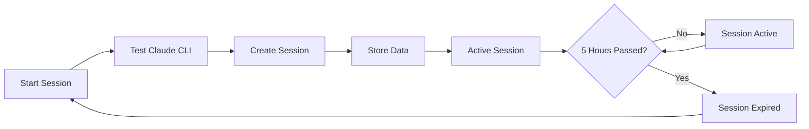

# Claude Pro Session Manager

A Python-based session manager for Claude Pro that automates the creation and tracking of Claude sessions to optimize usage within 5-hour windows. The system provides intelligent session lifecycle management through automated scheduling and comprehensive status tracking.

## Features

- 🚀 **Automated Session Management**: Seamlessly create and track Claude Pro sessions
- ⏰ **5-Hour Window Optimization**: Intelligent tracking of session expiration times
- 📊 **Real-time Status Monitoring**: Check current session status and remaining time
- 🔧 **Clean Architecture**: Well-structured codebase with clear separation of concerns
- 🛡️ **Error Handling**: Comprehensive error management and user-friendly messages
- 🎨 **Rich Terminal Output**: Beautiful formatted output using Rich library
- 🔄 **Force Session Override**: Option to force new sessions when needed

## Architecture

The application follows clean architecture principles with distinct layers:

```
src/
├── domain/          # Core business models and exceptions
├── infrastructure/  # External dependencies (Claude CLI, file storage)
├── services/        # Business logic (SessionManager)
├── config/          # Application settings and configuration
└── utils/           # Formatting utilities
```

## Prerequisites

- Python 3.10 or higher
- [Claude CLI](https://github.com/anthropics/claude-cli) installed and configured
- macOS (primary platform, with plans for cross-platform support)

## Installation

### Method 1: pipx (Recommended)

```bash
# Install pipx if not already installed
brew install pipx
pipx ensurepath   # apoi deschide un shell nou

# Clone and install
git clone <repository-url>
cd claude-code-sessions-manager
pipx install .

# Verify installation
claude-sessions status
```

### Method 2: Development Setup

1. **Clone the repository**:

   ```bash
   git clone <repository-url>
   cd claude-code-sessions-manager
   ```

2. **Install dependencies**:

   ```bash
   pip install -r requirements.txt
   ```

3. **Verify Claude CLI installation**:
   ```bash
   claude --help
   ```

## Usage

### Quick Start

**With pipx installation (recommended):**

```bash
# Start a new session immediately
claude-sessions start-now

# Check current session status
claude-sessions status

# Force start a new session (override active session)
claude-sessions start-now -f
```

**With development setup:**

```bash
# Start a new session immediately
python -m claude_code_session_manager start-now

# Check current session status
python -m claude_code_session_manager status

# Force start a new session (override active session)
python -m claude_code_session_manager start-now -f
```

### Command Reference

| Command     | Description                                     | Options                                         |
| ----------- | ----------------------------------------------- | ----------------------------------------------- |
| `start-now` | Creates and activates a new Claude session      | `-f, --force`: Override existing active session |
| `status`    | Displays current session information and status | None                                            |

### Example Output

```bash
$ claude-sessions start-now
✅ Sesiune activată cu succes!

$ claude-sessions status
📊 Sesiune Claude Pro
├── 📅 Creată: 2024-01-15 14:30:25
├── ⏰ Expiră: 2024-01-15 19:30:25
├── ✅ Status: Activă
└── 🕐 Timp rămas: 4h 23m
```

## Configuration

The application uses environment variables for configuration with sensible defaults:

| Variable                 | Default          | Description                      |
| ------------------------ | ---------------- | -------------------------------- |
| `SESSION_DURATION_HOURS` | `5`              | Session window duration in hours |
| `SESSION_FILE_PATH`      | `"session.json"` | Path to session storage file     |
| `CLAUDE_TIMEOUT_SECONDS` | `10`             | Claude CLI command timeout       |
| `CLAUDE_MAX_TURNS`       | `1`              | Maximum conversation turns       |
| `CLAUDE_OUTPUT_FORMAT`   | `"json"`         | Claude CLI output format         |

### Setting Environment Variables

```bash
# Temporary (current session)
export SESSION_DURATION_HOURS=6
export SESSION_FILE_PATH="/path/to/custom/session.json"

# Permanent (add to ~/.bashrc or ~/.zshrc)
echo 'export SESSION_DURATION_HOURS=6' >> ~/.zshrc
```

## Development

### Setup Development Environment

```bash
# Install development dependencies
pip install -r requirements.txt

# Install pre-commit hooks (if using)
pre-commit install
```

### Code Quality Tools

```bash
# Linting
ruff check .

# Code formatting
ruff format .

# Type checking
basedpyright
```

### Testing

```bash
# Run all tests
python run_tests.py

# Run with different verbosity levels
python run_tests.py -v 1    # Less verbose
python run_tests.py -q      # Minimal output

# Run specific test module
python run_tests.py -m test_models
```

### Project Structure

```
claude-code-sessions-manager/
├── src/
│   ├── config/
│   │   └── settings.py          # Configuration management
│   ├── domain/
│   │   ├── models.py            # Session model
│   │   └── exceptions.py        # Custom exceptions
│   ├── infrastructure/
│   │   ├── claude_client.py     # Claude CLI integration
│   │   └── storage.py           # File-based session storage
│   ├── services/
│   │   └── session_manager.py   # Core business logic
│   └── utils/
│       └── formatters.py        # Output formatting utilities
├── tests/                       # Comprehensive test suite
├── main.py                      # CLI entry point
├── requirements.txt             # Python dependencies
├── CLAUDE.md                    # Development instructions
└── README.md                    # This file
```

## How It Works

1. **Session Activation**: Tests Claude CLI availability and creates a new session
2. **Data Persistence**: Stores session metadata in JSON format for reliability
3. **Status Tracking**: Monitors session expiration and provides real-time status
4. **CLI Integration**: Seamless integration with Claude CLI for actual AI interactions

### Session Lifecycle



## Troubleshooting

### Common Issues

**Claude CLI not found**:

```bash
# Verify Claude CLI installation
which claude
# If not found, install from: https://github.com/anthropics/claude-cli
```

**Permission denied on session file**:

```bash
# Check file permissions
ls -la session.json
# Fix permissions if needed
chmod 644 session.json
```

**Session not activating**:

```bash
# Check Claude CLI status
claude --help
# Verify network connectivity
ping anthropic.com
```

## Contributing

1. Fork the repository
2. Create a feature branch (`git checkout -b feature/amazing-feature`)
3. Run tests and linting (`python run_tests.py && ruff check .`)
4. Commit your changes (`git commit -m 'Add amazing feature'`)
5. Push to the branch (`git push origin feature/amazing-feature`)
6. Open a Pull Request

## Future Enhancements

- 🤖 **LaunchAgent Integration**: Automated session scheduling on macOS
- 🌐 **Cross-platform Support**: Windows and Linux compatibility
- 📈 **Usage Analytics**: Session usage statistics and insights
- 🔔 **Notifications**: Alert system for session expiration
- 🎯 **Smart Scheduling**: Intelligent session timing based on usage patterns

## License

This project is licensed under the MIT License - see the LICENSE file for details.

## Support

For issues and questions:

- 🐛 **Bug Reports**: Open an issue on GitHub
- 💡 **Feature Requests**: Create a feature request issue
- 📧 **General Questions**: Use GitHub Discussions

---

Made with ❤️ for optimizing Claude Pro usage
